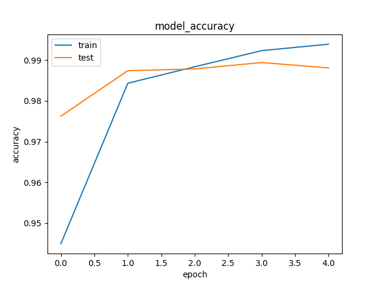

# LeNet
The Convolutional Neural Network propsed by Yann Le Cunn to classify the MNIST images.

# Usage
1. Create a virtual environment by running <code>virtualenv -p python3 <your_env_name></code> and activate it by running <code>source <your_env_name>/bin/activate</code>.
2. Clone this repository into that environment.
3. Run <code>pip install -r requirements.txt</code>
4. cd to Model_LeNet.
4. Now run <code>python yann_le_cunn_net.py</code> and it should work

# Results

